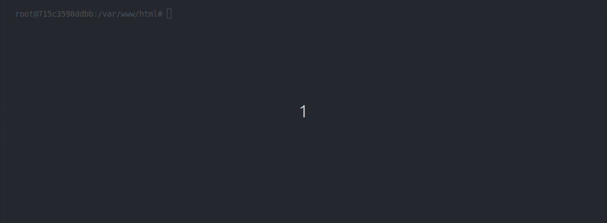

# ⚡ Laravel Snap

<p align="center">
  <a href="https://packagist.org/packages/mkaram/laravel-snap"></a>
  <a href="https://packagist.org/packages/mkaram/laravel-snap"></a>
  
  
  <a href="LICENSE"></a>
</p>

> **Granular pattern capture, architectural blueprint scaffolding, dependency-aware transplantation, and native AI MCP engine for Laravel.**



---

## 💡 Why Laravel Snap?

Moving features between Laravel applications (like `Wallet`, `OTP`, `Subscription`, or `Invoicing`) is traditionally messy:
- You manually hunt down dozens of scattered files across `app/`, `database/`, and `config/`.
- You waste time fixing namespaces, imports, and broken timestamps on migrations.
- You run into `Class not found` errors when third-party packages are missing.

**Laravel Snap** turns any feature into a portable, dependency-aware architectural blueprint that you can snapshot and install into any target Laravel project in seconds.

---

## ✨ Key Features

- 🔍 **Deep Multi-Layer Discovery:** Recursively scans `Models`, `Services`, `Actions`, `Contracts`, `DTOs`, `Events`, `Controllers`, `Requests`, `Resources`, `Notifications`, `Jobs`, `Policies`, `Rules`, `Migrations`, and `Config`.
- ⚡ **AST-Powered Skeleton Mode (`--skeleton`):** Uses PHP Abstract Syntax Tree parsing (`nikic/php-parser`) to strip method bodies while keeping strict return types, docblocks, and properties intact — generating pristine domain interfaces ready for logic implementation.
- 📦 **Smart Dependency Resolver:** Scans imported `use` statements against `installed.json`, identifies required 3rd-party Composer packages (e.g. `stripe/stripe-php`), and offers interactive auto-installation during setup.
- 🔄 **Dynamic PSR-4 Namespace Translation:** Tokenizes root namespaces on snapshot and rebinds them dynamically to match the target project's application namespace.
- 🕒 **Safe Database Migrations:** Automatically recalculates migration timestamps upon installation to ensure correct schema execution order without conflicts.
- 🤖 **Native Model Context Protocol (MCP) Server:** Seamless `stdio` integration with **Cursor**, **Windsurf**, and **Claude Code** to scaffold patterns right from your AI prompt.
- 🐳 **Docker & Team-Ready:** Zero-config storage path resolution supporting Host OS, Docker containers, and project-level Git repository sharing.

---

## 🚀 Installation

Install the package via Composer into your Laravel application:

```bash
composer require mkaram/laravel-snap --dev
```

---

## 📚 Documentation

Full guides live in [`docs/`](docs/):

| Guide | Description |
| --- | --- |
| [Introduction](docs/01-getting-started/introduction.md) | What Laravel Snap is and the problems it solves |
| [AST Skeleton Mode](docs/02-core-concepts/ast-skeleton-mode.md) | `--skeleton` blueprints powered by `nikic/php-parser` |
| [Dependency Resolution](docs/02-core-concepts/dependency-resolution.md) | How Composer packages travel with a snapshot |
| [CLI Reference](docs/03-cli-reference/commands.md) | `snap:pattern`, `snap:install`, and `snap:list` |
| [Cursor & MCP Integration](docs/04-ai-and-mcp/cursor-integration.md) | Native stdio MCP server for Cursor and Windsurf |# laravel-snap
# laravel-snap
